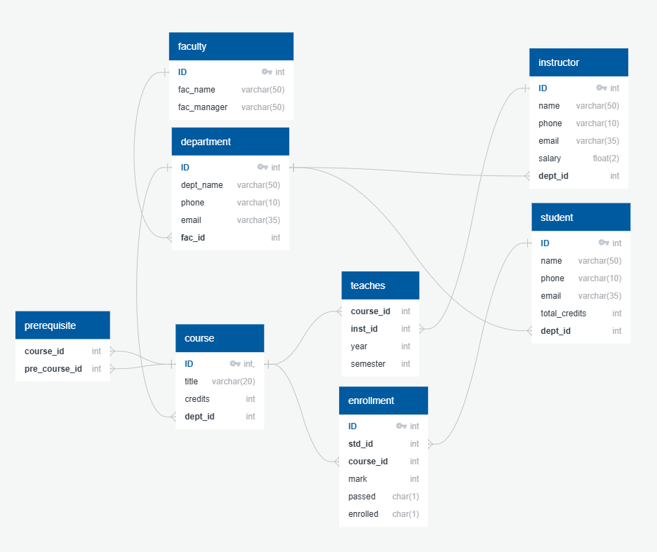

# Design Document

By Mohanad M. Abusabha

## Scope

The purpose of this database is to facilitate the management of a university's core data, enabling efficient storage, retrieval,
and tracking of information about faculties, departments, courses, students, and instructors.
It supports academic and administrative operations by organizing key data entities and their relationships.

Included in Scope:
* Faculties, including their managers.
* Departments within faculties.
* Courses offered by departments.
* Students, including their enrollment in courses and departments.
* Instructors and the courses they teach.

Outside of Scope:
* Detailed attendance records.
* Staff other than instructors.
* Facilities or non-academic services (e.g., library, dormitories).
* Financial records or payroll data.

## Functional Requirements

This database will support:
* CRUD operations for faculties, departments, courses, students, and instructors.
* Tracking student enrollments in courses.
* Assigning instructors to courses.

Note that in this iteration, the system will NOT support the following:
* Automated grading or assessment systems.
* Tracking alumni or post-graduation activities.
* Scheduling or timetabling.

## Representation

Entities are captured in SQLite tables with the following schema.

### Entities

The database includes the following entities:

### Faculties

The `faculty` table includes:

`ID`: The unique identifier for the faculty (INTEGER, PRIMARY KEY).
`fac_name`: The name of the faculty (TEXT, NOT NULL).
`fac_manager`: The name of the faculty manager (TEXT, NOT NULL).

### Departments

The `department` table includes:

`ID`: The unique identifier for the department (INTEGER, PRIMARY KEY).
`dep_name`: The name of the department (TEXT, NOT NULL).
`fac_id`: The ID of the faculty to which the department belongs (INTEGER, FOREIGN KEY referencing faculty(ID), NOT NULL).

### Courses

The `course` table includes:

`ID`: The unique identifier for the course (INTEGER, PRIMARY KEY).
`course_name`: The name of the course (TEXT, NOT NULL).
`dep_id`: The ID of the department offering the course (INTEGER, FOREIGN KEY referencing department(ID), NOT NULL).

### Students

The student `table` includes:

`ID`: The unique identifier for the student (INTEGER, PRIMARY KEY).
`first_name`: The student's first name (TEXT, NOT NULL).
`last_name`: The student's last name (TEXT, NOT NULL).
`dep_id`: The ID of the department to which the student belongs (INTEGER, FOREIGN KEY referencing department(ID), NOT NULL).

### Instructors

The `instructor` table includes:

`ID`: The unique identifier for the instructor (INTEGER, PRIMARY KEY).
`first_name`: The instructor's first name (TEXT, NOT NULL).
`last_name`: The instructor's last name (TEXT, NOT NULL).
`dep_id`: The ID of the department to which the instructor belongs (INTEGER, FOREIGN KEY referencing department(ID), NOT NULL).

### Enrollments

The `enrollment` table includes:

`student_id`: The ID of the student enrolled in a course (INTEGER, FOREIGN KEY referencing student(ID), NOT NULL).
`course_id`: The ID of the course in which the student is enrolled (INTEGER, FOREIGN KEY referencing course(ID), NOT NULL).

### Course Assignments

The `course_assignment` table includes:

`instructor_id`: The ID of the instructor teaching a course (INTEGER, FOREIGN KEY referencing instructor(ID), NOT NULL).
`course_id`: The ID of the course taught by the instructor (INTEGER, FOREIGN KEY referencing course(ID), NOT NULL).

### Relationships

The below entity relationship diagram describes the relationships among the entities in the database.

As detailed by the diagram:

* Each faculty can have multiple departments, but each department belongs to only one faculty.
* Each department can offer multiple courses, but each course belongs to only one department.
* Each department can have multiple students and instructors, but each student and instructor belongs to only one department.
* Each course can have multiple students enrolled and multiple instructors assigned. Students and instructors can be linked to multiple courses.

## Optimizations

Indexes:
* Created indexes on `dep_id` for quick lookups of related entities in `department`, `student`, `course`, and `instructor` tables.
* Indexed `student_id` and `course_id` in the `enrollment` table to optimize queries related to student enrollments.
* Indexed `instructor_id` and `course_id` in the `course_assignment` table to optimize queries related to instructor assignments.

Views:
* Created a view for retrieving all courses taught by each instructor, along with the enrolled students, for simplified reporting.
* Created a view for retrieving department-wise student counts for administrative insights.

## Limitations

* The design assumes a student and instructor belong to only one department. This limits the ability to support cross-departmental affiliations.
* Collaborative courses involving multiple departments or faculties are not represented explicitly.
* The system does not support tracking of detailed academic performance or grades.
* Historical data, such as course assignments or enrollments over time, is not retained.
